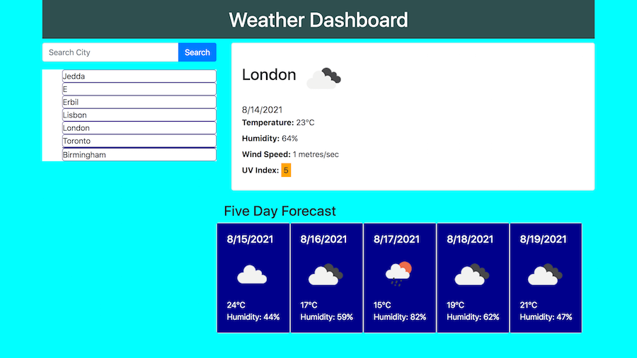

# Check-the-weather

An interactive weather dashboard that displays temperature, humidity, wind speed, UV index and a 5 day forecast for the user's chosen cities.  

Featuring icons to represent weather conditions and colour coded UV values.  

User inputs are logged into "localStorage" to show last searched city after refreshing the page. 

Powered by Bootstrap, jQuery and the [Open Weather One Call API](https://openweathermap.org/api/one-call-api).    

NOTE: Please enter city name followed by a comma, space & country name to avoid confusion e.g. Birmingham, UK vs Birmingham, USA. 

## Working links
* Repo : https://github.com/mz0121coder/Check-the-weather/
* Main URL: https://mz0121coder.github.io/Check-the-weather/

## Screenshot
  
